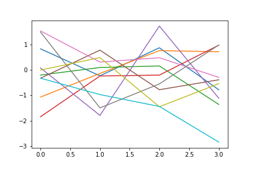
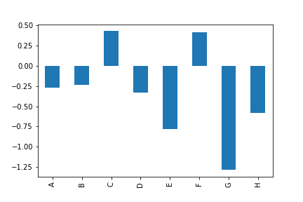
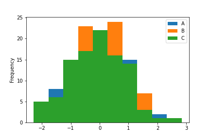
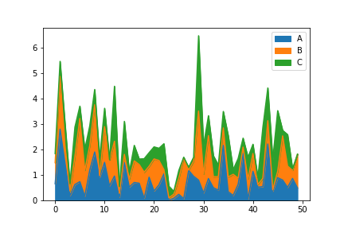
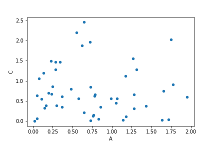

---

There are many solid libraries and modules that can support producing plots and make your data visualized. By the way, pandas can support us for visualizing with some simple functions.

- `df.plot(data, x=None, y=None, kind='line', subplots=False, layout, figsize, use_index=True, title, grid=None, legend, style, logx=False, logy=False, xticks, yticks, xlim, ylim, xlabel, ylabel, rot=None, fontsize=None, colormap=None, )`:  makes plots of Series or DataFrame. Uses the backend specified by the
option `plotting.backend`. By default, matplotlib is used.
  - `data`: Series or DataFrame. The object for which the method is called.
  - `x`: label or position. Only used if data is a DataFrame.
  - `y`: label, position or list of label, positions. it allows plotting of one column versus another. Only used if data is a DataFrame.
  - `kind`: str.The kind of plot to produce:
    - 'line' : line plot (default)
    - 'bar' : vertical bar plot (or `df.plot.bar()`)
    - 'barh' : horizontal bar plot (or `df.plot.barh()`)
    - 'hist' : histogram (or `df.plot.hist()`)
    - 'box' : boxplot (or `df.plot.box()`)
    - 'kde' : Kernel Density Estimation plot
    - 'density' : same as 'kde'
    - 'area' : area plot (or `df.plot.area()`)
    - 'pie' : pie plot (or `df.plot.pie()`)
    - 'scatter' : scatter plot (or `df.plot.scatter()`)
    - 'hexbin' : hexbin plot.
  - `subplots`: bool. Make separate subplots for each column.
  - `layout`: tuple (optional). (rows, columns) for the layout of subplots.
  - `figsize`: a tuple (width, height) in inches
    Size of a figure object.
  - `use_index`: bool. Use index as ticks for x axis.
  - `title`: str or list. Title to use for the plot. If a string is passed, print the string at the top of the figure. If a list is passed and `subplots` is True, print each item in the list above the corresponding subplot.
  - `grid` : bool. Axis grid lines.
  - `legend`: bool or {'reverse'}. Place legend on axis subplots.
  - `style`: list or dict. The matplotlib line style per column.
  - `logx`: bool or 'sym'. Use log scaling or symlog scaling on x axis.
  - `logy`: bool or 'sym'. Use log scaling or symlog scaling on y axis.
  - `xticks`: sequence. Values to use for the xticks.
  - `yticks`: sequence. Values to use for the yticks.
  - `xlim`: 2-tuple/list. Set the x limits of the current axes.
  - `ylim` : 2-tuple/list. Set the y limits of the current axes.
  - `xlabel`: label (optional). Name to use for the xlabel on x-axis. Default uses index name as xlabel, or the x-column name for planar plots.
  - `ylabel`: label (optional). Name to use for the ylabel on y-axis. Default will show no ylabel, or the y-column name for planar plots.
  - `rot`: int. Rotation for ticks (xticks for vertical, yticks for horizontal plots).
  - `fontsize`: int. Font size for xticks and yticks.
  - `colormap`: str or matplotlib colormap object. Colormap to select colors from. If string, load colormap with that name from matplotlib.


#### Simple plot
```
import pandas as pd
import numpy as np

df = pd.DataFrame(np.random.randn(4,10))
df.plot(legend=False)
```



#### Bar Chart
```
import pandas as pd
import numpy as np

index = ['A', 'B', 'C', 'D', 'E', 'F', 'G', 'H']
df = pd.DataFrame(np.random.randn(8), index=index)

df.plot(legend=False, kind='bar')
```


#### Histogram
```
import pandas as pd
import numpy as np

df = pd.DataFrame({'A': np.random.randn(100),
                  'B': np.random.randn(100),
                  'C': np.random.randn(100)}, columns=['A','B','C'])

df.plot(kind='hist')
```



#### Area plot
```
import pandas as pd
import numpy as np

df = pd.DataFrame(np.abs(np.random.randn(50,3)), columns=['A','B','C'])

df.plot(kind='area')
```



#### Scatter plot
```
import pandas as pd
import numpy as np

df = pd.DataFrame(np.abs(np.random.randn(50,3)), columns=['A','B','C'])

df.plot(kind='scatter', x='A', y='C')
```

